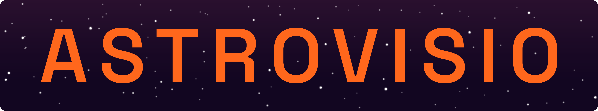

# Astrovisio

**Astrovisio** is a Unity-based VR application for immersive visualization of astrophysical datasets. It provides interactive tools to explore scientific data using colormaps and advanced data mapping techniques.

## Prerequisites

Before launching Astrovisio, make sure the following components are installed:

- **Docker Desktop**  
    The application relies on a backend API server for data access and processing.  
    This server is provided by [AstroAPI](https://github.com/Astrovisio/AstroAPI), which runs as a Docker container. You must first install **Docker** and run AstroAPI using the instructions in its repository.

> ⚠️ Docker and AstroAPI must be running before starting the client, or the application will not be able to load datasets.

- **Meta Quest Link** (optional)  
    Required **only** if you intend to use the application in **VR mode**.  
    You can download Meta Quest Link here:  
    👉 [https://www.meta.com/quest/setup/](https://www.meta.com/quest/setup/)

## VR Setup

Astrovisio currently supports:

- **Meta Quest 2**
- **Meta Quest 3**

To enable VR functionality:

1. Install **Meta Quest Link** on your PC.
2. Connect your headset using:
    - **Link Cable** (recommended for best performance)
    - Or **Air Link** (for wireless streaming)
3. Ensure your headset is **set to PC VR mode** via the Meta Link interface.

> ❗ Without Meta Quest Link properly configured, the application will not enter VR mode.

## Project Setup

Clone the **main** branch of the repository and open the project with **Unity 6000.0.43.f1**, all dependencies will solve automatically.

>***Known Issue***
>Updating Unity minor version causes problems with VR stereoscopic rendering: 
>the data point cloud is not rendered on the right eye.

The MainScene is Assets\\_Astrovisio\\Scenes\\MainScene.unity

## Video Recording

The video recording feature is implemented using [NSR - Screen Recorder](https://assetstore.unity.com/packages/tools/integration/nsr-screen-recorder-cross-platform-video-capture-256062).
Since *NSR - Screen Recorder* is a payed plugin, it is not included in this repository.

The **video_recording** branch includes all the code that connects *NSR - Screen Recorder* to Astrovisio, but not the plugin itself.

>**IMPORTANT**: The provided packaged Release includes all features including Video Recording.

## Release

#### How to Run
1. Download the latest version from the [Releases] section.
2. Extract the downloaded `.zip` archive.
3. Open the extracted folder.
4. **Double-click on `Astrovisio.exe`** to launch the application.

> ⚠️ Ensure that Docker + AstroAPI are running before launching.  
> 🎮 VR headset is optional – required only for immersive data visualization.

The [User Manual](./UserManual/). can be found in the ./UserManual folder in this repository.

## Notice

Astrovisio uses and adapts some code from [iDaVIE](https://github.com/idia-astro/iDaVIE).
Details are provided in the headers of the involved source files.

## Copyright and Licence

Copyright (C) 2024-2025 Alkemy, Metaverso. This program is free software; you can redistribute it and/or modify it under the terms of the [GNU Lesser General Public License (LGPL) version 3](https://github.com/idia-astro/iDaVIE/blob/main/LICENSE.md) as published by the Free Software Foundation.