# Astrovisio User Manual
V. 0.0.53 - 27/10/2025

## Preface

The purpose of this Minimum Viable Product (MvP) release is to distribute Astrovisio with enough core features to be used by early customers.
This is the second release of Astrovisio after the Proof of Concept (PoC).

The purpose of the PoC was to gather as much feedback as possible on the functionalities during the live demo session at the Scuola Normale Superiore of Pisa.

This MVP ships with the complete integration of the UI and agreed feature list, ensuring the best possible User Experience.

---
## 00. REQUIREMENTS AND SETUP

### System Requirements

##### Hardware Requirements
Hardware requirements vary a lot according to the amount of data you want to visualize.

###### Minimum:
- 16GB Ram
- Nvidia RTX 3060 / AMD RX 6600 XT
- Intel 11th Gen i5 / AMD 5th Gen Ryzen5

##### OS Requirement
Astrovisio is designed and developed to work with Windows 10/11.
- **Windows 10/11 (64-bit)** (Native Support)
- macOS (Desktop Mode Only): The application can be run in Desktop mode on macOS devices with Apple Silicon (M-series) processors by using the free Whisky application. More information is available at: [https://getwhisky.app/](https://getwhisky.app/)
 - Linux (Desktop Mode Only): For Linux environments, compatibility for running the application in Desktop mode is managed via ProtonDB. More information is available at: [https://www.protondb.com/](https://www.protondb.com/)

##### VR Requirements (Windows Only)
- GPU with VR support and updated drivers
- VR headset compatible with OpenXR (e.g., Meta Quest 2 or 3 via Link)

>*Note*: VR Mode: The VR experience has been tested and is officially supported only on Meta Quest devices connected to a Windows operating system.

### Setup

Astrovisio requires its backend, [AstroAPI](https://github.com/Astrovisio/AstroAPI), to correctly process the input data.
AstroAPI is a Dockerized RESTful API designed to manage and process astrophysical data projects. While it functions as a standalone service, it is primarily intended to offload data processing tasks from Astrovisio's Unity desktop application.

The instructions to install Docker and properly setup the container are available in the public GIT repository at the following link: https://github.com/Astrovisio/AstroAPI/blob/main/README.md.

>[!WARNING]
>Docker containers cannot access the device local storage directly. 
During the Docker setup you specified the VOLUME_SOURCE path inside the .env file you created.
>
>It is mandatory that any file (.hdf5 or .fits) you want to load and visualize in Astrovisio is placed inside a folder named “astrodata” inside the VOLUME_SOURCE folder you specified.
>If the “astrodata” folder is not there you must create it manually.
>
>**Example**
>.env:
>
>```
>VOLUME_SOURCE="D:\AstroAPI\DockerVolume"
>```
>
>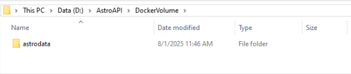


---
## 01. HOME PAGE 

The **Home Page** is the main dashboard to manage your projects.

It **lists all the projects** with their details and their **available actions** (**Add to Favorites**, **Edit**, **Clone**, **Delete**), the **search bar**, the **favorite** projects and the options to create a **New Project** or **Import** a saved project.

Open Projects appear as tabs on the top navigation bar to provide quick project switching.

*The following picture shows a HOME PAGE with 3 total projects, two of them added as Favorite and two of them opened.*

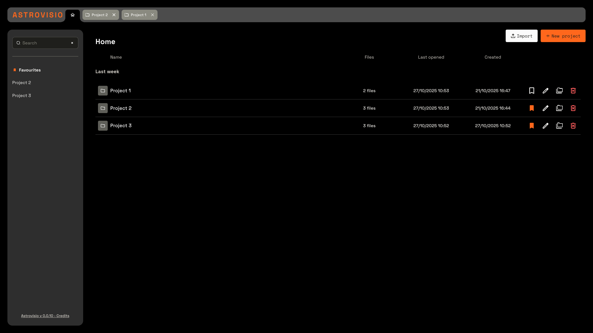


---
## 02. CREATE A PROJECT

To create a new project select the **New Project** option located in the top-right corner of the Home Page.

This action opens a form with input fields for the **Project Name** and **Project Description**, as well as an area for **uploading your files**.

> *Note*: It is also possible to **Import** a project by selecting a Project Export file from the device.

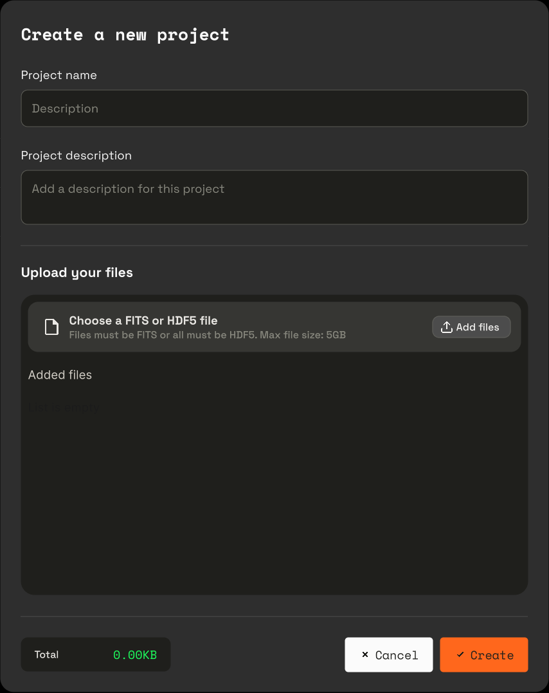


> *Note*: files can be added to the project during the Project Creation phase or during the Data Settings phase.

To add Files during the Project Creation click the **Add files** button and select the desired FITS or HDF5 files.
Once selected, the disk space occupied by the files will be shown in the bottom-left corner.

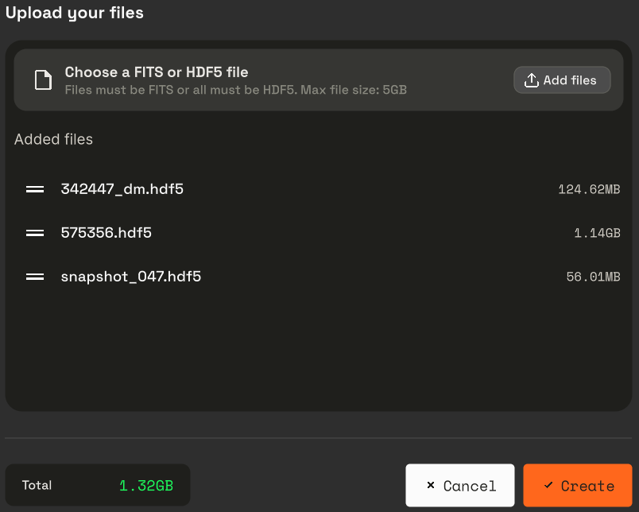

If more than 1 file is added it is possible to change the file order simply dragging the file row to the desired spot in the list.

To remove a previously added file click the red **Trash icon** that appears while hovering the file row
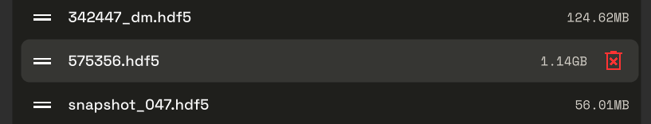

Click **Cancel** to abort the project creation procedure and return to the Home Page.
Click **Create** to create a new project with the specified information and files.

A loading spinner will appear, indicating that the Project is being processed. 
Once the process is complete, the new project will be displayed as the first item in the list on the Home Page.


---
## 03. WORK WITH A PROJECT

To open a project click on it from the projects list, or from the favorite projects list, in the Home Page.

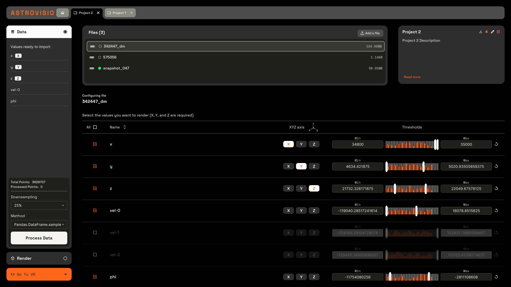

A project is a container of files and they're settings.

Project's properties and options are shown in the top right section.

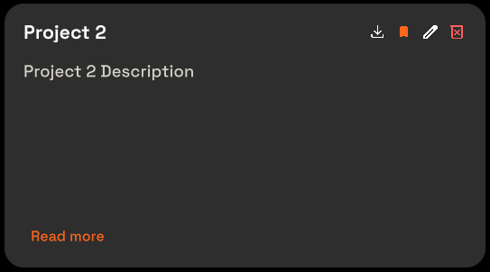

The 4 icons shown in the top right corner of the project's detail sections are:
**Export**, **Favorite**, **Edit**, **Delete**.

> *Note*: the Export option creates a JSON file that can be used by you or another user to import the project with the same settings. In order for the import to work the same HDF5 or FITS files must be available in the astrodata backend folder.


The **Files** section allows you to select, add, order or remove files from the project.

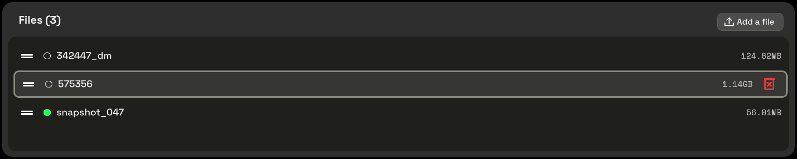

By clicking on a file row the settings for that file are shown in the section below.

Each file can be in an unprocessed (🔘) or processed (🟢) state. Only processed file can be visualized. To process a file it's necessary to perform some Data Settings.

### Data Settings
The **Data** settings section allows you to decide which *attributes* you want to use for the 3D visualization of the specific file.

Each file comes with a set of *attributes*. 

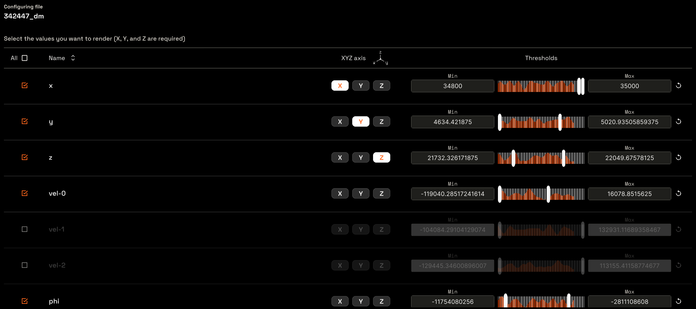

An *attribute* can be selected or deselected clicking on the checkbox on the left side of the *attribute* row.

Each *attribute* has a Name and a Range. To adjust the range you can use the **Threshold slider** or manually type in the desired value in the **Min**/**Max** input fields on the sides of the slider.

A 3D visualization requires three important information: **WHERE**, **WHAT** and **HOW**.

In order to provide the **WHERE** information it is mandatory to decide witch 3 attributes represent the X, Y and Z spatial coordinate.
Any attribute can be used as axis by selecting the axis name on the **XYZ Axis** column.

The **WHAT** is any additional attribute selected but not mapped as axe.

The **HOW** is managed in the next section: the **Rendering** settings.

You can check which attributes are selected and which of them is mapped to an axis checking the left section.

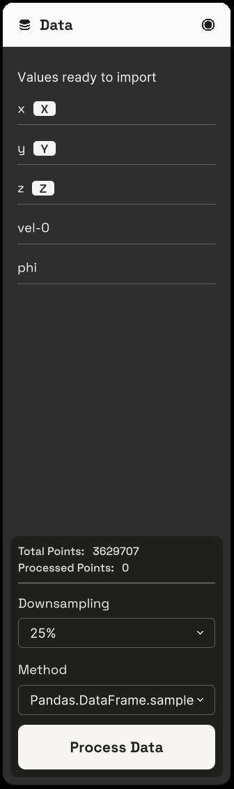

Once the attribute selection, thresholds and axis mapping are done the file must be processed. Before processing is possible to select a **Downsample** amount.

Perform the processing by pressing the **Process Data** button.

> *Note*: If the Process Data button is not clickable it means that not all axes are provided.

The processing may take some time depending on the size and complexity of the original file.

Once successfully processed a green circle icon (🟢) is displayed near the file name in the Files section.

> *Note*: the file process is performed server-side. Not selected attributes or discarded ranges are not sent to the client for the 3D visualization. If you need to modify the selected attributes or the specified thresholds you can do it, but you need to process the file again.

> *Note*: if the filters applied result in an empty subset of data the following error is displayed
>
>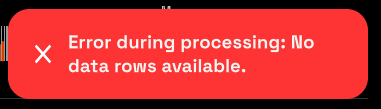

Once all the files you want to visualize are Processed (🟢) you can proceed to the **Render** section by clicking the Render button located in the bottom left corner.

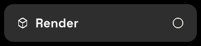

> *Note*: It is possible to skip the desktop 3D visualization and directly start the Virtual Reality visualization by clicking on the **Go To VR** button instead.

### Render Settings
The **Render** settings allows you visualize the selected attributes, to personalize how they are displayed, and to perform selection and readings.

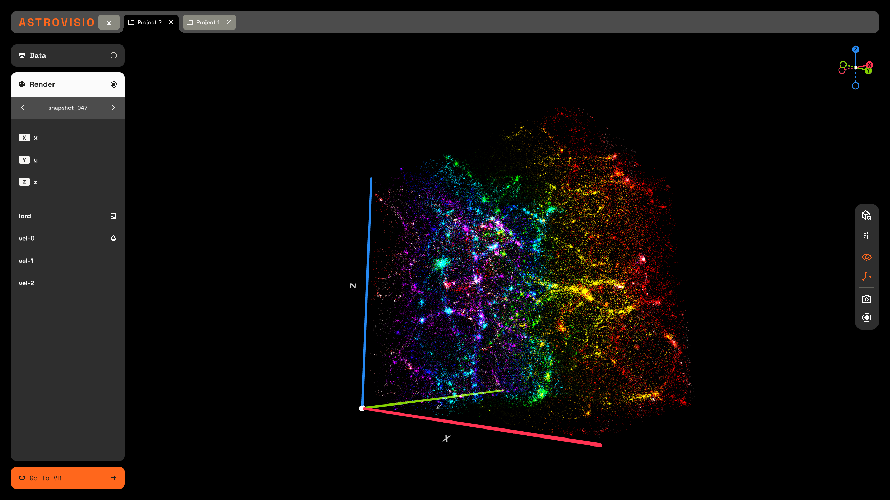

#### 3D Navigation
You can perform the following actions to interact with the 3D visualization:

**Zoom**: use the mouse scroll wheel to zoom in and out.
**Rotate**: click and drag with the left mouse button to rotate the view.
**Pan**: click and drag with the right mouse button to pan the view.

#### Visual Mapping
The left-hand panel displays the data you previously selected, organized into two groups: the data mapped to the X, Y, and Z axes, and all remaining data columns. select it from the left-hand panel. When interacting with a value a contextual menu will open, showing the available options for that specific item.

Selecting an attribute a contextual menu with the available visualization options are shown.

For all attributes except for the one used as axes, the contextual menu will provide three Mapping options: None, Opacity, Colormap.

**None**: no visual mapping is applied to the data. This is the default state when the visualization first initializes.

**Opacity**: maps the data values to an opacity level, ranging from 0% to 100%. You can define this range using the Threshold controls, either by using the sliders or by entering numerical values from your keyboard.

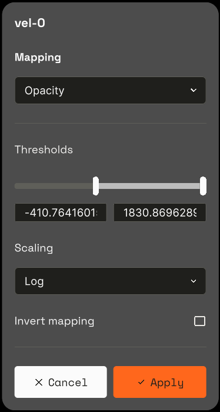

**Colormap**: This option is similar to Opacity, but differs by applying a color map (a gradient of colors) to the selected range of values. It maintains the same functionalities for adjusting Thresholds, Scaling, and Invert Mapping that were previously described. You can choose from a multitude of predefined colormaps to visualize your data.

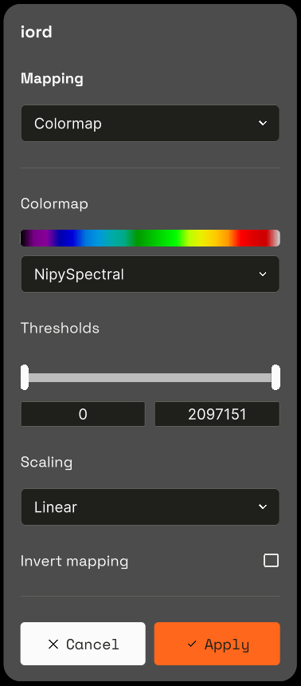

Both **Opacity** and **Colormap** allows you to adjust the **Threshold**, the **Scaling** and enable the **Inverse Mapping** option.

Thresholds and Scaling can be adjusted also on axis mapped attributes.

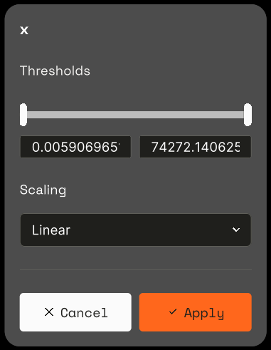

Once an attribute is mapped an icon appears near the attribute name:

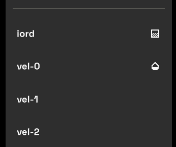

To visualize the next or previous file you can use the arrows **< >** at the top of the left-side panel placed on the sides of the current file name.

> *Note*: If you need to change the axis mapping or the selected attributes you can click on the **Data** button located at the Top-Left corner, perform the needed changes and process the file again.

#### Selections and Tools
###### Compass
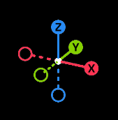

Located on the Top-Right corner the 3D compass allows you to keep the orientation.

###### Tools Bar


Located to the Right, it contains the following function:

**Inspector**: 
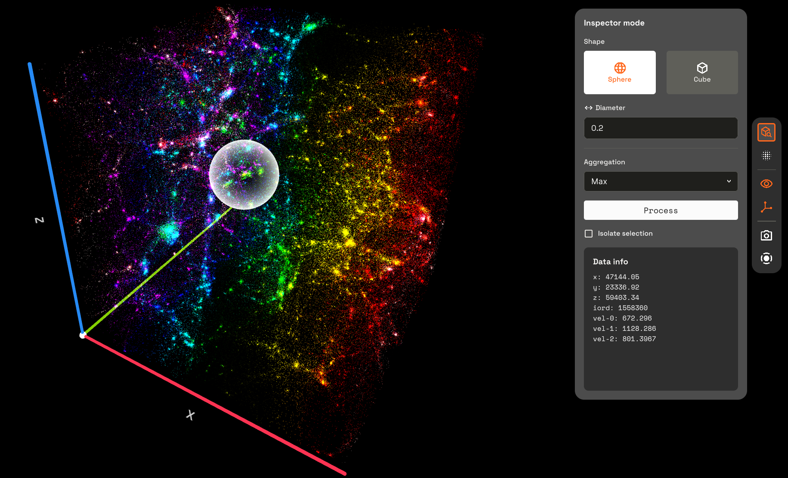

It allows you to perform data selections. You can chose the selection **Shape** (**Sphere** or **Cube**) and **Size** (**Diameter** or **Side**), the **Aggregation** type and if to **Isolate the Selection**.

Available Aggregation types are: **Average**, **Sum**, **Min**, **Max**, **Median**.

The result of the selection is displayed in the **Data info** section.

**Noise**:
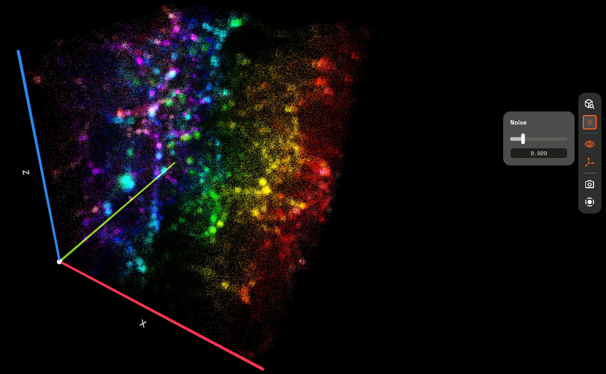

It allows you to add a visual noise to the visualization. It only affects the visualization, not the data.
This can be useful to remove annoying pattern repetition or moirés effects when data is disposed in a homogenous grid.

**Show/Hide UI**: Toggle the user interface
**Show/Hide Axis**: Toggle the axis
**Capture Screenshot**: Save an image of the current visualization along with a JSON containing the various settings details.
**Screen Recorder**: Allows you to start and stop a screen recording.

---
## 04. VIRTUAL REALITY MODE

The Virtual Reality Mode (VR Mode) allows you to experience the data visualization in a more immersive and engaging way.

To enable the VR Mode you need to ensure your device is correctly setup and you have the appropriate hardware.

### Launching VR Mode: Step-by-Step Guide
To ensure the VR visualization mode launches correctly, please verify that both the Meta Quest desktop client and your headset's software are installed and updated to the latest versions. 

More information is available at: https://www.meta.com/it-it/help/quest/1517439565442928/

Before launching, you must establish a connection between your headset and your PC.

1. Launch the Meta Quest desktop client on your PC.

2. From your headset, enable either Air Link (wireless) or Quest Link (wired).
   
   Recommendation: For the most stable and fluid experience, we recommend using a wired Quest Link connection.

2. Once the link is active, you can launch Astrovisio in VR by selecting the Go To VR option within the application.


#### Controls
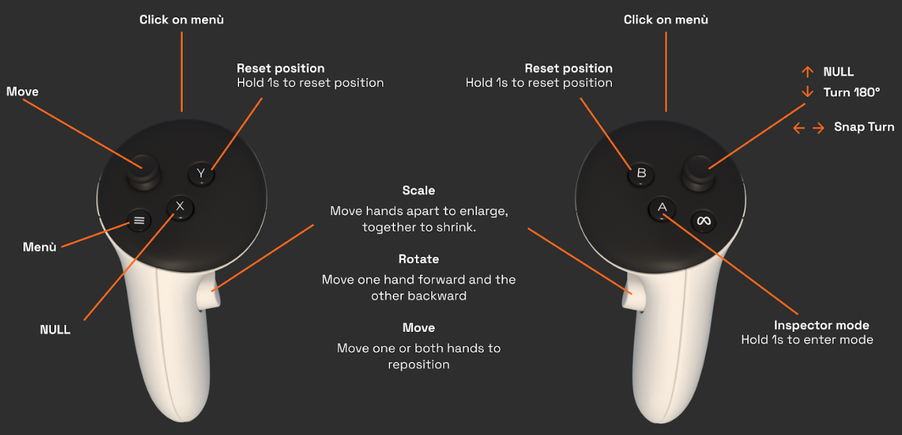

To **Move** the entire visualization cube, press and hold the Grip button on either controller (the button located where your middle finger rests). While keeping the button pressed, move the controller to reposition the cube.

To **Rotate**, press and hold the Grip buttons on both controllers simultaneously. Then, move your hands as if rotating a physical object (e.g., one hand moves forward while the other moves back).

To **Scale**, press and hold the Grip buttons on both controllers simultaneously. To enlarge the view, move your hands apart. To shrink the view, bring your hands closer together.


**Reset Position**: You can restore the initial view position by pressing and holding the 'B' button on the right controller or the 'Y' button on the left controller for one second.

#### VR Tools Bar
By pressing the Menu button on your left controller a menu similar to the Tools Bar previously described appears.

From the VR Tools Bar you can access the same feature of the Tools Bar and Visual Mapping, but in a VR fashion.
To select an option on the VR interface point it with the right controller and select it by pressing the front trigger of the right controller.

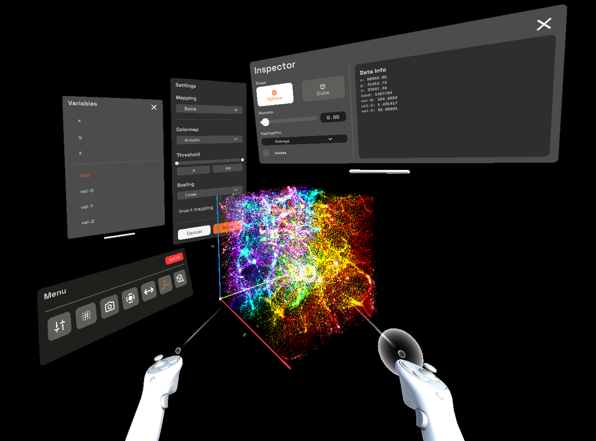

To perform a selection open the Inspector, select the desired selection options, position the selection volume over the points you want to select by moving your right hand and press A on your right controller.

You can **Exit** the VR Mode by selecting **Exit VR** from the VR Tools Bar.

> *Note*: you can adjust the position of each menu by pointing the white bar located at the bottom and dragging it while pressing the front trigger button of the controller.

---
## 05. IMPLEMENTATION DETAILS

### Points Selection
To enhance spatial selection performances binary KDTree(s) are built for each data cube in the original data space. The KDTree(s) regenerate only when a different attribute is selected for a specific axis.

The complexity of analyzing each point (brute force) to check if it matches the spatial query is O(N), using KDTree(s) is O(log N) making it the best choice for real-time performance.

Building the KDTree(s) is not free, consumes resources and computing time. Thanks to forward and inverse scaling we can build it only once at the beginning of the visualization instead of at every modification to scaling done by the user in real-time while interacting manipulating the visualization, especially in VR.

### Data Scaling
Forward and inverse data scaling allows to transform the points coordinates from data space to world space and vice versa. 
#### Forward Scaling
Forward scaling is applied by the shader code, the original data is not modified. This allows to show the Data in the normalized World Space.

**Linear**: x
**Log**: sign(x) × log₁₀(1 + |x|)
**Sqrt**: sign(x) × √|x|

#### Inverse Scaling
Inverse scaling is applied for the selection, when it's necessary to go back from World Space to Data Space in order to correctly query the KDTree(s).

**Linear**: y
**Log**: sign(y) × (10^|y| - 1)
**Sqrt**: sign(y) × y²

### Known Issue(s)

#### Visualization-Selection Mismatch
When selecting points in a scaled space (Log or Sqrt), if these points stands in an interval near 0, the visualization and the selection mismatch. This is notable when the "Isolate Selection" option is enabled.
This probably happens due to a different precision in the scaling algorithm since the forward scaling (the visualization) is performed by the shader code in the GPU (lower precision), while the inverse scaling (the selection) is performed by the C# code in the CPU (higher precision).
This should be only a visual mismatch, but further analysis on the selection results should be performed to ensure the returned values are correct regardless the visualization.

---
## 06. ENJOY ASTROVISIO!